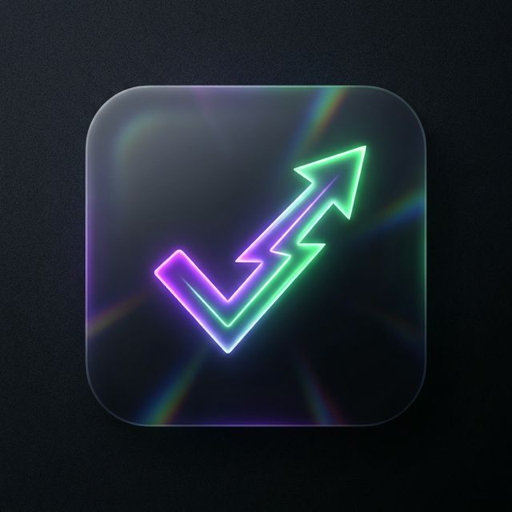

<div align="center">
  
  
  # ⚔️ QuestDo 
  **Where Productivity Meets Adventure**
  
  <p>
    <a href="https://react.dev/"></a>
    <a href="https://www.typescriptlang.org/"></a>
    <a href="https://vitejs.dev/"></a>
    <a href="https://tailwindcss.com/"></a>
    
  </p>

  *Turn your mundane daily to-dos into an epic RPG quest! Level up your life, build unbreakable streaks, and conquer your goals.*
</div>

---

## 🌟 Why QuestDo?

Traditional to-do lists are boring. They remind you of work. **QuestDo** reminds you of victory. 
Built as a blazing-fast, local-first Progressive Web App (PWA), it seamlessly blends habit tracking and task management with addictive RPG mechanics. Stop just checking boxes—start completing quests.

## 🔥 Epic Features

### 🗡️ Level Up Your Life
Every task is a quest. Earn **XP** for completing your to-dos, fill up your XP bar, and level up just like in your favorite RPG! The progressive XP curve ensures that every new rank feels like a true achievement.

### 🛡️ Guard Your Health
Missed a deadline? Procrastinated too long? You'll take damage! **Keep your Health Bar (HP) high** by staying on top of your responsibilities. If you drop to zero... you'll face the consequences of broken discipline.

### ⚡ Unbreakable Streaks & Combos
Consistency is king. Build daily **Streaks** to unlock powerful XP multipliers. Chain tasks together in quick succession to activate **Combo Multipliers** and sky-rocket your productivity stats!

### 🏆 Unlock Achievements
Collect beautiful badges and unlock unique **Achievements** as you hit major milestones. From "First Blood" (creating your first task) to "Unstoppable" (reaching a legendary streak), there's always a new goal to strive for.

### 📊 Deep Stats & Analytics
Visualize your productivity journey:
- **Heatmap Calendars** 📅 See your daily activity at a glance.
- **Dynamic XP & Growth Charts** 📈 Track your growth over the last 7 days.
- **Achievement Showcase Grid** 🌟 Show off all the badges you've earned.

### 📱 Perfect PWA Experience
Install **QuestDo** directly to your phone or desktop.
- **Offline-First:** Works anywhere, anytime. Your data stays completely private in LocalStorage.
- **Native Feel:** Fluid 60fps animations powered by **Framer Motion**.
- **Responsive:** Beautiful layout adapting perfectly from mobile phones to ultra-wide displays.

---

## 🛠️ The Tech Arsenal

We forged QuestDo using the most modern web technologies:

| **Technology** | **Purpose** |
|:---|:---|
| ⚛️ **React 19** | Cutting-edge UI rendering |
| 🛡️ **TypeScript** | Bulletproof, type-safe code |
| ⚡ **Vite** | Lightning-fast build & dev server |
| 🎨 **Tailwind CSS** | Gorgeous, utility-first styling |
| 🐻 **Zustand** | Snappy, lightweight state management |
| 🎞️ **Framer Motion**| Buttery-smooth, captivating animations |
| 📈 **Recharts** | Interactive data visualization |
| 📱 **Vite PWA** | Native app capabilities & offline mode |

---

## 📁 Project Architecture

```plaintext
src/
├── components/
│   ├── gamification/     # XP bar, Health bar, Streak counter, Level badge
│   ├── layout/           # App shell, Bottom navigation for PWA
│   ├── stats/            # Achievement grid, Heatmap, XP charts
│   └── tasks/            # Task cards, Forms, Task lists
├── lib/                  # Gamification logic & Achievement definitions
├── pages/                # Dashboard, Tasks, Stats, Settings, Onboarding
├── stores/               # Zustand stores (tasks, user, achievements)
└── types/                # Strict TypeScript definitions
```

---

## 🚀 Embark on Your Quest (Installation)

Ready to begin your adventure? Setting up your local guild hall is easy:

### Prerequisites
Make sure you have **Node.js 18+** and `npm` installed.

### Setup

```bash
# 1. Clone the repository
git clone https://github.com/YOUR_USERNAME/QuestDo.git

# 2. Enter the dungeon
cd QuestDo

# 3. Equip your gear (install dependencies)
npm install

# 4. Start the adventure (run dev server)
npm run dev
```

### Build for Production
```bash
npm run build
npm run preview
```

---

## 💡 The Philosophy

We believe that productivity shouldn't feel like a chore. By integrating universally loved game mechanics—like immediate rewards (XP), tangible consequences (HP loss), and visual progression (Levels & Badges)—we hijack the brain's dopamine system to make doing chores as addictive as playing a video game.

## 📄 License

This quest is completely open-source under the **MIT License**. Feel free to fork, modify, and build upon it! 
Good luck, Hero! ⚔️
